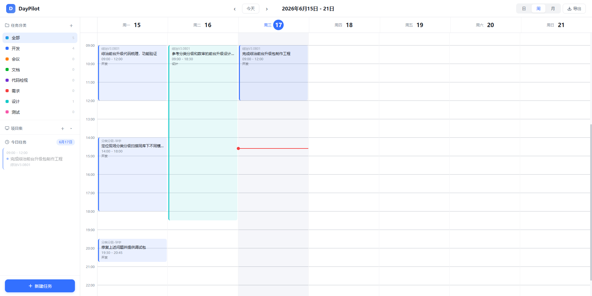
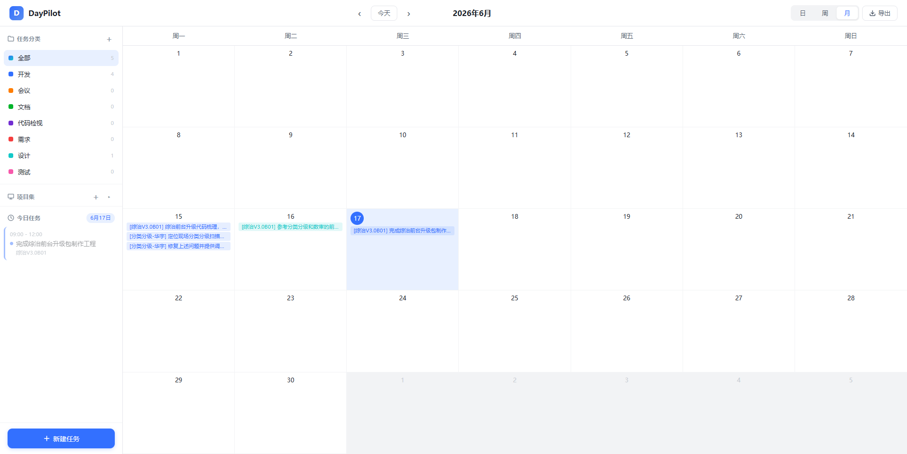

# DayPilot - 日程领航员

一个功能完整的日程管理 Web 应用，采用纯原生 HTML/CSS/JavaScript 实现，无需任何依赖。


## 功能特性

### 多视图日历
- **日视图**：单日详细时间轴
- **周视图**：一周七天并排显示（默认）
- **月视图**：月度概览

| 周视图 | 月视图 |
|:---:|:---:|
|  |  |

### 任务管理
- 创建/编辑/删除任务
- 拖拽式时间选择（15分钟对齐）
- 实时时间线显示
- 任务属性：标题、项目、分类、日期、时间段

### 分类与项目
- 预设分类：开发、会议、文档、代码检视、需求、设计、测试
- 自定义分类管理
- 项目分组与筛选

### 数据管理
- File System Access API 文件读写
- localStorage 降级方案
- Markdown 格式导出

## 快速开始

直接在浏览器中打开 `code.html` 即可使用，无需安装任何依赖或启动服务器。

```
daypilot/
├── code.html           # 主应用文件
├── sched_tasks.json    # 任务数据
├── sched_cats.json     # 分类配置
├── sched_projects.json # 项目列表
└── doc/                # 文档目录
```

## 技术亮点

- 零依赖，单文件运行
- 参考飞书日历的现代化 UI 设计
- CSS 变量主题系统
- 流畅的动画效果
- 响应式布局，支持移动端

## 使用场景

- 个人日程管理与时间规划
- 项目进度跟踪
- 工作记录导出
- 时间分配分析

## License

MIT
